## 一、例会信息

**时间**：2026年10月09日

**地点**：北教3-406

**主讲人**：郑鑫城，陶瑞奇，徐奕轩

**主要内容**：接锅流程简要讲解和部门两台设备的使用讲解

## 二、文件资料

<iframe src="/visual-studio-docs/documents/曝光三要素.pdf" width="100%" height="600px"></iframe>

- [接锅流程.pptx](/visual-studio-docs/documents/接锅流程.pptx)
- [索尼a7m3例.docx](/visual-studio-docs/documents/索尼a7m3例.docx)

## 三、相机入门知识介绍详细板块

📷 相机入门知识介绍

## 相机入门知识介绍

> 本文根据《相机知识一·认识相机》与《相机知识二·相机按键的使用》两份课程资料整理而成，以**索尼 α7 III（a7m3）**为示例机型。全文分为三部分：**认识相机**、**按键与档位**，以及补充的**延伸知识**（画幅对比、曝光三要素进阶入口）。

_封面图来源：Pexels（免版税 / CC0），摄影师 Ivandrei Pretorius_

---

### 目录

- [一、例会信息](#一例会信息)
- [二、文件资料](#二文件资料)
- [三、相机入门知识介绍详细板块](#三相机入门知识介绍详细板块)
- [相机入门知识介绍](#相机入门知识介绍)
  - [目录](#目录)
  - [一、认识相机](#一认识相机)
    - [1.1 机身概览：正面与背面](#11-机身概览正面与背面)
    - [1.2 充电与电池](#12-充电与电池)
    - [1.3 相机卡口](#13-相机卡口)
    - [1.4 镜头](#14-镜头)
    - [1.5 存储卡与各类接口](#15-存储卡与各类接口)
  - [二、认识相机按键与档位](#二认识相机按键与档位)
    - [2.1 常用按键](#21-常用按键)
    - [2.2 拍摄档位](#22-拍摄档位)
  - [三、延伸知识（进阶引导）](#三延伸知识进阶引导)
    - [3.1 画幅对比](#31-画幅对比)
    - [3.2 曝光三要素进阶](#32-曝光三要素进阶)
- [| **感光度 ISO**     | 传感器灵敏度    | 过高会带来噪点、损失动态范围          |](#-感光度-iso------传感器灵敏度-----过高会带来噪点损失动态范围----------)
  - [参考资料与图片版权](#参考资料与图片版权)

---

### 一、认识相机

#### 1.1 机身概览：正面与背面

**正面**：主要包括镜头卡口、快门按键、手柄、品牌与型号标识等。不同品牌的机身布局各有差异，下面是若干相机的正面概览。

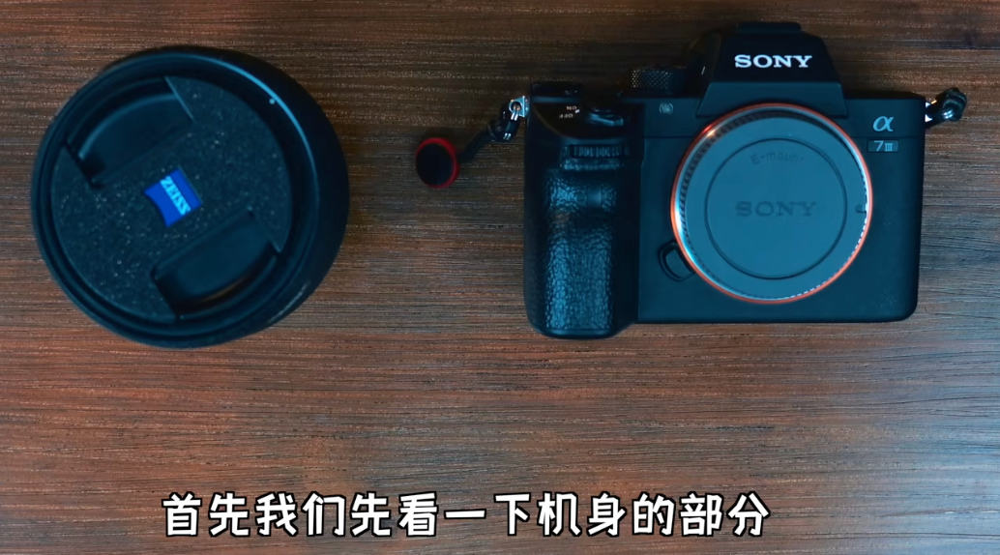

**背面（操作监视面）**：机身背面是摄影师的主要操作区。以这台索尼 a7m3 为例，画面既可以通过**显示器（屏幕）**查看，也可以通过**取景器**查看。

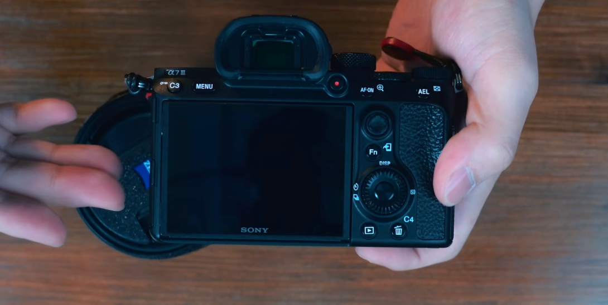

- **显示器**：可以打开显示器、上翻或变换角度，方便低机位或俯拍取景。
- **取景器**：带有眼罩；按住眼罩两侧的两个小按键并往上推，即可取下眼罩。

#### 1.2 充电与电池

这台索尼 a7m3 使用**可拆卸电池**，通过 USB 充电器充电。充电时指示灯亮起，充满后指示灯熄灭。

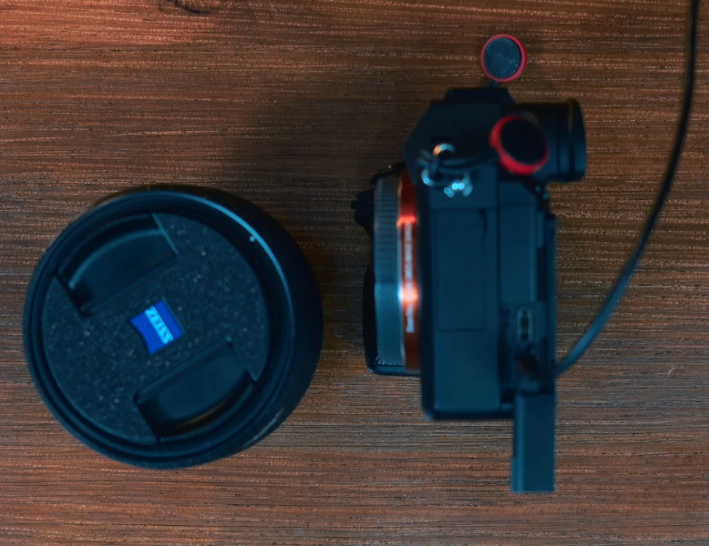

索尼 a7m3 官方充电注意事项：

- 完全充电时间约为 **285 分钟**（基于 25 °C 下给完全放电的电池充电，实际视使用条件可能更长）。
- 充电结束时充电指示灯熄灭。
- 若指示灯点亮后立即熄灭，说明电池已处于充足电状态。

- 索尼官方充电说明：<https://helpguide.sony.net/ilc/1720/v1/zh-cn/contents/TP0001666190.html>

> 不同品牌、不同机型的充电方式（座充 / 直充 / 快充协议）不尽相同，跨品牌使用时请以各自官方说明为准。

#### 1.3 相机卡口

镜头的 **卡口（Mount）** 是机身与镜头之间的连接接口。索尼使用的镜头卡口为 **E 口**。

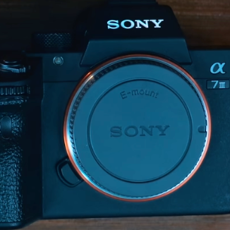

- 索尼、佳能（RF / EF）、尼康（Z / F）、松下（L 口）等不同品牌的卡口**互不通用**。
- 使用**转接环**可以连接原本不兼容的相机与镜头，但通常会带来对焦速度、画质等方面的**一定性能损耗**。

#### 1.4 镜头

镜头由**镜头盖、后镜盖**，以及**对焦环、变焦环、光圈环**等部件组成。镜头上通常标有**最近对焦距离**，即能够清晰合焦的最近拍摄距离，比它更近则无法对焦。

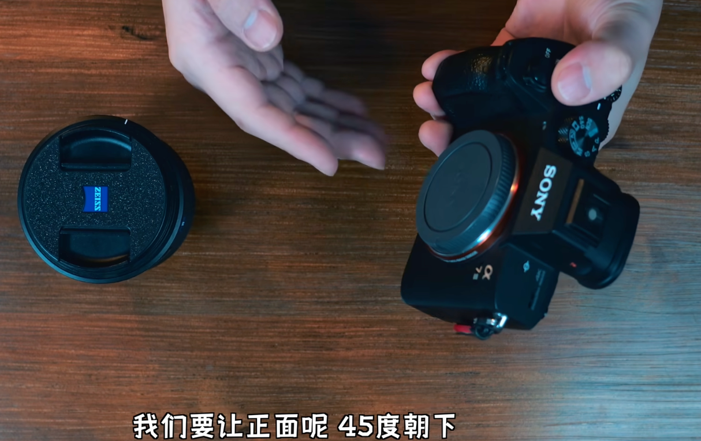

**镜头的类别与区别（入门要点）**

| 分类维度 | 常见类型              | 特点                                   |
| -------- | --------------------- | -------------------------------------- |
| 能否变焦 | 定焦镜头 / 变焦镜头   | 定焦光圈更大、画质更优；变焦取景更灵活 |
| 焦距     | 广角 / 标准 / 长焦    | 焦距越短视角越广，越长越“拉近”         |
| 光圈     | 恒定大光圈 / 普通光圈 | 大光圈虚化更强、暗光更从容             |

**安装与拆卸镜头**

- 安装时要让机身**正面朝下**，再拧开机身盖，避免灰尘落入。
- 感光元件 **CMOS** 若朝上放置极易落灰；若已落灰，保持朝下 **45°** 用气吹吹走灰尘。

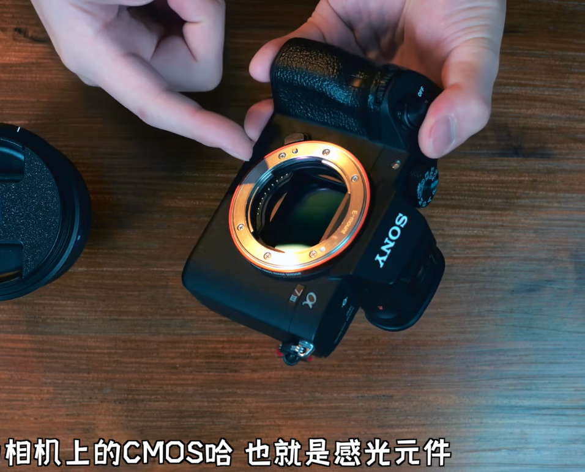

- **安装**：对齐镜头与机身卡口的凸点标记，顺时针旋转，听到“咔吧”一声即为装好。
- **拆卸**：按住机身把手处的镜头释放开关，逆时针旋转镜头即可取下。
- 拆下或更换镜头时，要**立即盖好**镜头盖、后镜盖、机身盖。

#### 1.5 存储卡与各类接口

| 位置 | 接口 / 部件 | 用途说明                                  |
| ---- | ----------- | ----------------------------------------- |
| 底部 | 电池仓      | 安装电池                                  |
| 侧面 | 三个仓门    | 3.5mm 耳机监听、HDMI 高清数据、麦克风收音 |

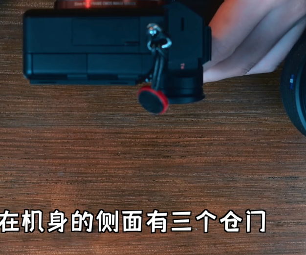

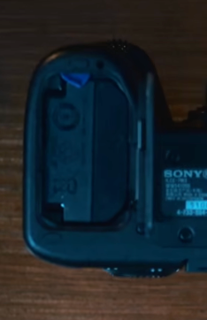

- **底部 1/4 螺丝接口**：可接三脚架或小型支架。

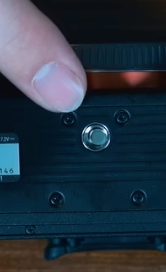

- **SD 卡槽（×2）**：选购 SD 卡时应选择带 **V30 或 U3** 标记的卡，才能录制 **4K** 高清视频；也可用 **TF 小卡**搭配 SD 卡套使用。

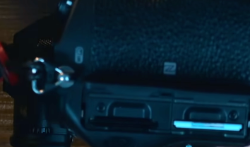

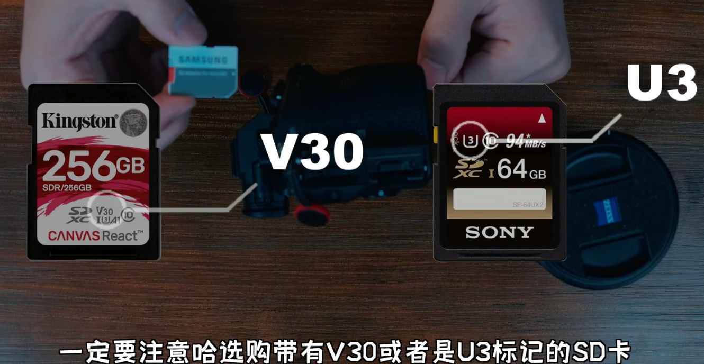

- **上方插槽（热靴等）**：可接入麦克风、监视器、云台等外设。

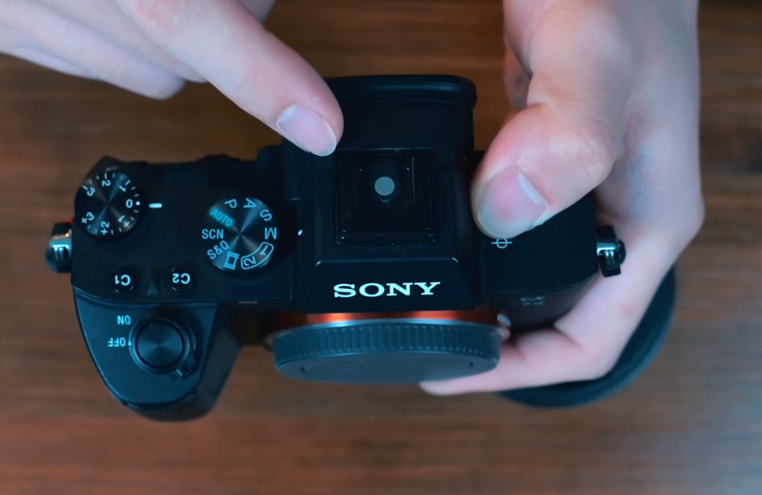

- **机身两侧**：可绑定背带、肩带、手腕带。

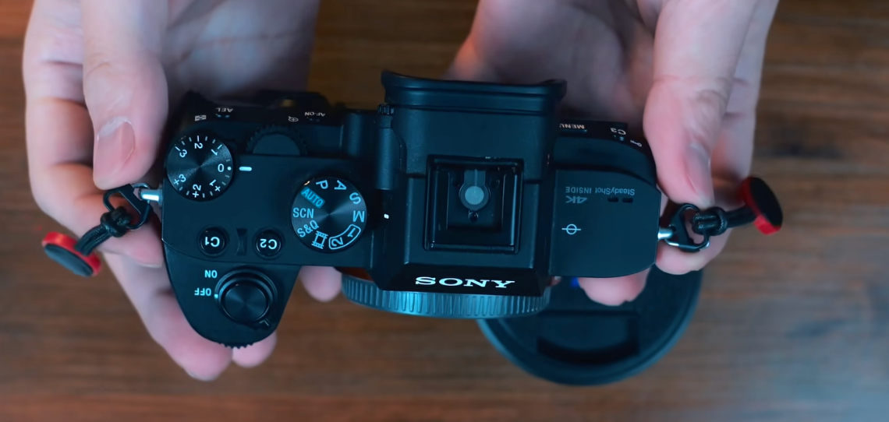

---

### 二、认识相机按键与档位

#### 2.1 常用按键

- **格式化**：在菜单中对 SD 卡执行格式化（会清空卡内数据，操作前请确认已备份）。

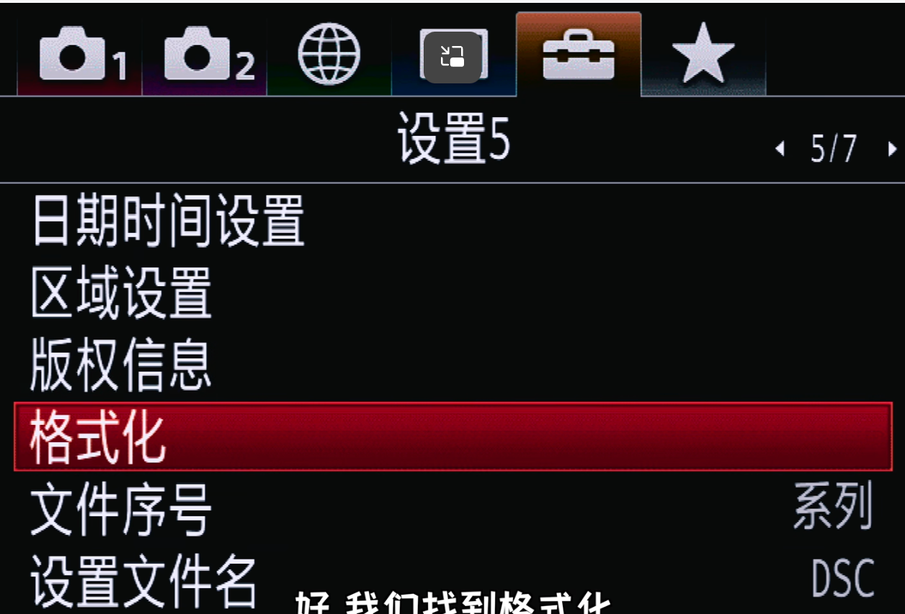

- **辅助照明灯（AF 辅助灯）**：在光线不足时辅助对焦。

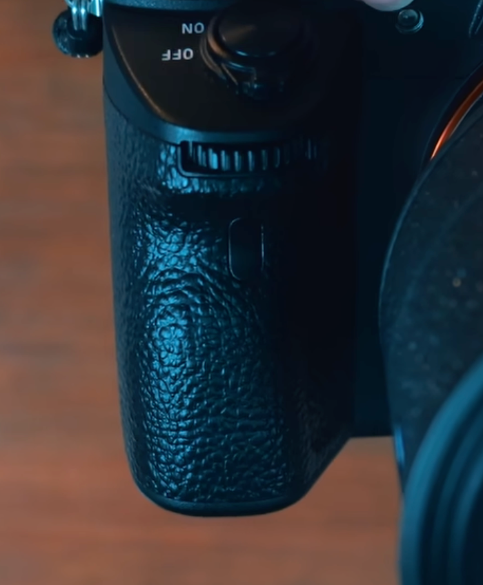

- **屈光度调节拨轮（取景器右侧小拨轮）**：调节**取景器**的清晰度，适合近视或远视使用者，可用于适应戴眼镜 / 不戴眼镜两种状态。

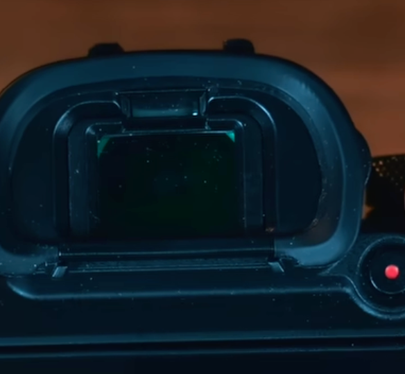

- **录制视频按钮 + AF-ON**：左侧为录制视频按钮；右侧 AF-ON 用于启动自动对焦与眼控对焦，还可放大视频影像。

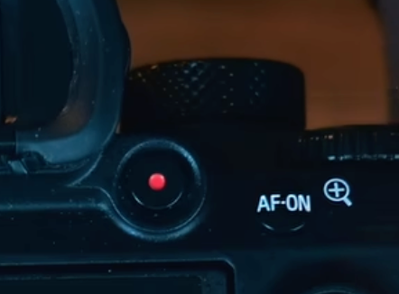

- **背面按键区**：C3、C4 为**自定义按键**；右侧自上而下依次为：**小摇杆**、**Fn 功能键**（调出预设功能）、**轮盘区**（显示 DISP、拍摄模式、连拍模式、ISO 等）、**查看照片**与**删除键**。

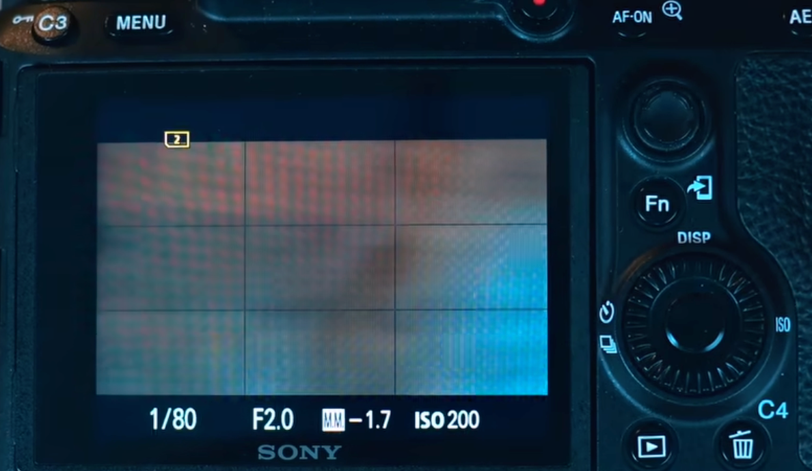

#### 2.2 拍摄档位

相机常见档位包括 **Auto（全自动）、P（程序自动）、A/Av（光圈优先）、S/Tv（快门优先）、M（全手动）** 等，各自对光圈、快门、ISO 的控制方式不同。

| 档位                   | 相机替你控制                  | 你能控制                     | 适用场景                   |
| ---------------------- | ----------------------------- | ---------------------------- | -------------------------- |
| **Auto（自动）**     | 光圈、快门、ISO、白平衡等全部 | 基本无需干预                 | 快速拍摄（笨蛋级别的）录                   |
| **P（程序自动）**      | 光圈 + 快门组合               | ISO、曝光补偿等              | 日常拍摄，自动与可控兼顾   |
| **A / Av（光圈优先）** | 快门速度                      | 光圈                         | 控制景深（人像、风景）     |
| **S / Tv（快门优先）** | 光圈                          | 快门速度                     | 运动、动态题材             |
| **M（全手动）**        | 无                            | 光圈、快门、ISO 全部         | 夜景、星轨、创意或复杂光线 |
| **B（Bulb 长曝光）**   | 无                            | 曝光时间（按住多久曝光多久） | 星轨、烟花、极长曝光       |

**各档位的典型用法**

- **A / Av（光圈优先）**：大光圈（如 f/1.8）→ 背景虚化；小光圈（如 f/11）→ 风景前中后景全清晰。
- **S / Tv（快门优先）**：高速快门（如 1/1000s）→ 凝固动作；低速快门（1/4s 至数秒）→ 动态模糊、水流丝滑。
- **M（手动档）**：光圈、快门、ISO 全由你控制，适合夜景、星轨、创意拍摄或复杂光线环境。
- **B（Bulb 档）**：快门按下多久就曝光多久，用于星轨、烟花、极长曝光。

**如何选择档位**

- 运动场景 → 优先 **S/Tv 或 M**（控制快门）
- 静止场景、人像、风景 → 优先 **A/Av 或 M**（控制景深）
- 快速记录 → **Auto 或 P**
- 创意 / 专业拍摄 → **M**

**其他模式**

- **S&Q 模式**：索尼特有的 Slow & Quick（慢动作与快动作）拍摄模式，通过前期帧率设置实现高质量慢放或快放视频。
- **SCN（Scene 场景模式）**：针对特定拍摄场景的自动设置模式，比全自动模式更有针对性，效果更佳。

---

### 三、延伸知识（进阶引导）

#### 3.1 画幅对比

**什么是画幅**：画幅指相机**感光元件（传感器）的尺寸**，相当于胶片时代“底片”的大小。画幅越大，单颗像素通常越能收到更多光线（同级技术下），也越容易获得更好的虚化和暗光表现。

**常见画幅从小到大**：手机传感器 < 1 英寸型 < M4/3 < APS-C < 全画幅 < 中画幅。

**关键概念：裁切系数（等效焦距）**

同一支镜头装在不同画幅机身上，得到的**视角**不同。换算公式：

> 等效焦距 = 镜头物理焦距 × 裁切系数

例如一支 50mm 镜头：装在全画幅上等效 50mm；装在 APS-C（系数 1.5）上约等效 75mm；装在 M4/3（系数 2.0）上等效 100mm。这也是小画幅机身“长焦更赚、广角吃亏”的原因之一。

**画幅大小的影响概览**

| 维度        | 大画幅（全画幅 / 中画幅） | 小画幅（APS-C / M4/3） |
| ----------- | ------------------------- | ---------------------- |
| 暗光 / 高感 | 通常更优                  | 相对较弱               |
| 背景虚化    | 更强、更浅景深            | 相对更弱               |
| 体积与重量  | 更大更重                  | 更小巧轻便             |
| 价格        | 更高                      | 更亲民                 |

> **进阶**（了解即可，不必深入）：等效光圈、景深与画幅的关系、像素密度与衍射极限。

#### 3.2 曝光三要素进阶

**三要素回顾**：一张照片的曝光由三个参数共同决定——

| 要素               | 控制的核心      | 主要“副作用”                          |
| ------------------ | --------------- | ------------------------------------- |
| **光圈**（f 值）   | 进光量 + 景深   | 过大/过小光圈影响清晰度（衍射、像差） |
| **快门速度**（秒） | 曝光时间 + 动态 | 过慢易手震模糊                        |
| **感光度 ISO**     | 传感器灵敏度    | 过高会带来噪点、损失动态范围          |
- 

**进阶要点**

1. **互易律（倒易律）**：相同的曝光量可以由不同的参数组合实现。开了光圈、就要相应加快快门或降低 ISO，反之亦然。
2. **“档（Stop）”**：光圈、快门、ISO 每变化一档，进光量翻倍或减半。例如 1/250s → 1/125s 是“亮一档”。
3. **各自的代价**：光圈影响景深与画质、快门影响手震与动态、ISO 影响噪点与动态范围——**在追求正确曝光之外，更要权衡三者带来的画面风格**。

> **进阶**掌握三要素后再学：直方图判光、测光模式、曝光补偿、包围曝光、向右曝光（ETTR）。

---

### 参考资料与图片版权

**内容来源**

- 索尼 α7 III 官方充电说明：<https://helpguide.sony.net/ilc/1720/v1/zh-cn/contents/TP0001666190.html>

**图片版权**

- 封面图：Pexels 免版税图片（Photo 1492518），摄影师 **Ivandrei Pretorius**。

<!-- 
 -->